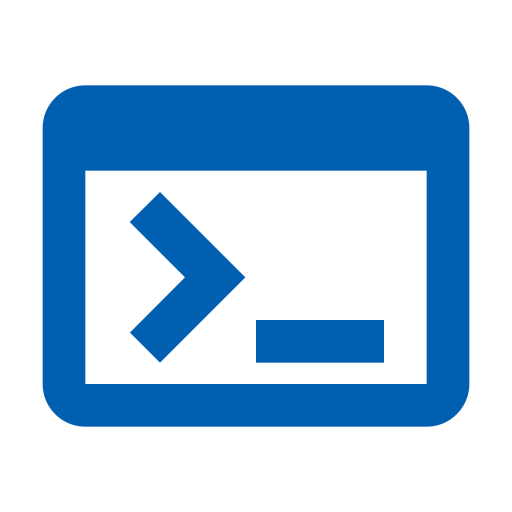

## list

1. test
2. test
   1. test
   2. test
      1. test
      2. test
3. test

- test
- test
  - test
  - test
    - test
    - test
- test

## fenced div

:::note
This is a note
:::

:::warning
This is a warning
:::

## definition

term1
: def1
: def2

term2
: def1

## link

<https://github.com/jme-rs>
<https://zenn.dev/loglass/articles/open-loglass-tech-stack-2023>

> <https://zenn.dev/loglass/articles/open-loglass-tech-stack-2023>

<https://twitter.com/jack/status/20>
<https://www.youtube.com/watch?v=jNQXAC9IVRw>
<https://github.com/octocat/Hello-World/blob/master/README>

## image




# h1 don't be used

Rust（ラスト）は、性能、メモリ安全性、安全な並行性を目指して設計されたマルチパラダイムのプログラミング言語である。C言語、C++に代わるシステムプログラミング言語を目指しており[^2]、構文的にはC++に似ているが[3]、「ボローチェッカー」(borrow checker) で参照の有効性を検証することによってメモリ安全性を保証できる。Rustはガベージコレクションなしでのメモリ安全性を達成しており、必要な場面で参照カウントを使うこともできる[4][5]。

[^2]: 注釈

## h2

Rust is a multi-paradigm, general-purpose programming language that emphasizes performance, type safety, and concurrency. It enforces memory safety, meaning that all references point to valid memory, without requiring the use of automated memory management techniques such as garbage collection. To simultaneously enforce memory safety and prevent data races, its "borrow checker" tracks the object lifetime of all references in a program during compilation. Rust was influenced by ideas from functional programming, including immutability, higher-order functions, and algebraic data types. It is popular for systems programming.[12][13][14]

### h3

Software developer Graydon Hoare created Rust as a personal project while working at Mozilla Research in 2006. Mozilla officially sponsored the project in 2009. In the years following the first stable release in May 2015, Rust was adopted by companies including Amazon, Discord, Dropbox, Facebook (Meta), Google (Alphabet), and Microsoft. In December 2022, it became the first language other than C and assembly to be supported in the development of the Linux kernel.

Rust has been noted for its rapid adoption,[15] and has been studied in programming language theory research.[16][17][18]

## text

text **bold** `code`  
*italic* ~~strike~~

> text **bold** `code`  
> *italic* ~~strike~~

## checkbox

- [ ] item
- [x] checked

## table

| react    | next.js | typescript |
| -------- | ------: | ---------- |
| Text     |     5.0 | Text       |
| markdown |   right | unified   |

## syntax highlight

```ts:test.ts
import { unified } from 'unified';
console.log("test");
```

> ```ts
> {
>   type: 'element',
>   tagName: 'h2',
>   properties: { className: [ 'sr-only' ], id: 'footnote-label' },
>   children: [ { type: 'text', value: 'Footnotes' } ]
> }
> ```
